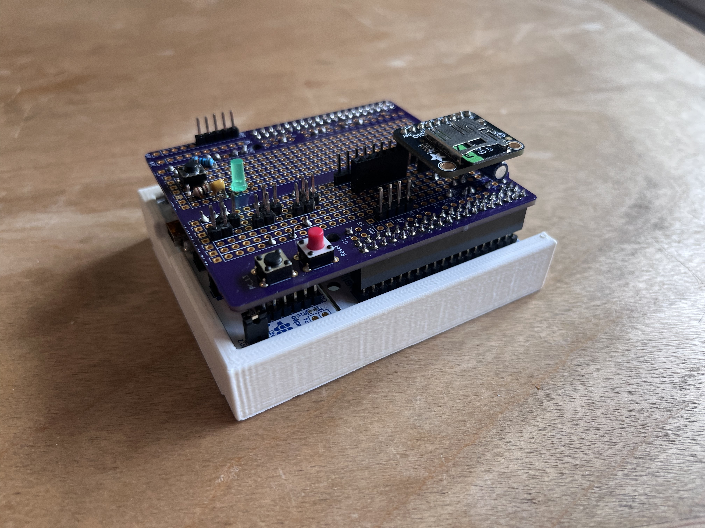
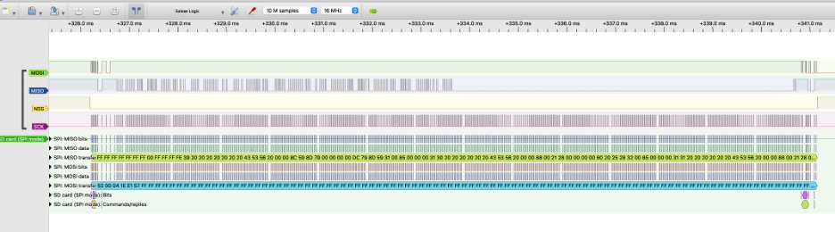

# dataloger
Cannek Heredia, Vrishika Vijay Mohite, and Joshua Mehlman present:

A Dataloger using the STM NUCLEO-L476RG, a MicroSD Card, and the FatFS library for SFSU ENGR 498 

## Table of Contents
- [Background](#background)
- [Tec-Stack](#Notes-on-the-Tec-Stack)
- [Using the datalogger](#Using-the-datalogger)

## Background
In 2008 Tesla was just shipping the first of the Roadsters. Unfortunately the chassis they had received from the UK had some issues with "Squeak"
My company was brought in to attempt to diagnose where the "Squeak" was coming from (It turned out to be many places!).
In order to do this our first task was to instrument the car and capture the "Squeak" in order to analyze it's charictor.
To do this, I setup a TEAC Digital Tape Data-logger. Well, it was not comfortable. See below.
It was also awkward to use. You had to record the data, then lug the entire instrument back to the lab and play the data back to your analysis equipment. Oh, I just checked and you can currently pick one of these up on eBay well used for $700.

When thinking about what we could do for our project, this experience jumped to my mind.
I wanted something small, lightweight, low power, and it had to write to a file.
We definitely did not want to truck with a filesystem, so we used a library to take care of the files themselves. We just had to write an SD Card driver... Oh, if I knew then what I knew now.

## Notes on the Tec Stack
- We used the <a href="http://elm-chan.org/fsw/ff/00index_e.html">FatFS</a> library by ChaN to take care of the files themselves. Oh, the FatFS web page usualy returns a 404. Please see the copy on by <a href="https://github.com/abbrev/fatfs"> Christopher Williams</a> Note, the documentaton is here also.
- The system is built with the Keil compiler. Some members used the Arm Keil Studio Pack under VS Code, and others used the Keil uVision. We did not use any of the ST HAL library functions, everything was done with Arm CMSIS

Each of these bits was hand-twiddled by our team of trained code monkeys.

In writing the software it was important to make sure that everything was interrupt driven. The only thing in the main loop is setup, and a command to go to sleep when not needed.

The circuitry is fairly simple. It turns out that the SD Card contains the SPI circutry!
All we needed was a few pull-up resisters (Ok, we used a <a href="https://www.adafruit.com/product/4682">$3.50 Micro SD Breakout</a> from our friends at Adafruit that had the pull-ups built in.
We also added a button for start stop, and an LED to indicate when a file is being written.
For shutdown and a heartbeat/status we used the button and LED that are built into the NUCLIO development board.

## Using the datalogger
The data logger is controlled by 3 Buttons, 
- Start/Stop Data: Added Button
- Power Off: the Built in "User" button
- Power On: The built in Reset Button

|Command	  |Required State	|Reset Btn|Off Btn|File Save Btn|
|:----------|:-------------:|---------|-------|-------------|
|Power  On  |Off	          |Press	  |       |             |
|Safe Mode	|Off	          |Press	  | Hold  |             |	
|Clock Set	|Off	          |Press		|       | Hold        |
|Take Data	|Ready	        |		      |       |Press|
|Stop Data	|Running	      |		      |       |Press|
|Power off	|Ready	        |	        |Hold	  |

LED Status
There are 2 LEDs
- Heart Beat/Status: The built in LED
- File Save: Added Led

|State      | Heart Beat|File Save|
|:----------|-----------|--------|
|Off	      |  Off	    |Off  |
|Ready	    |1Hz	      |Off
|Taking Data|5Hz	      |On During File Save|
|Power Down	|On	        |On|
|Error	    |100Hz	    |Prior State|
|Safe Boot	|40Hz	      |Off|

Data: 
The sensor name, calibration, and units are configured in [chData.c](/chData.c)

The Output File is created on boot as <number>.csv. Where number is the next available file. 
E.X.: 0.csv is created when booting to an empty disk. 

The file format is as follows with the first line the sensor name, the second line the units, and subsequent lines are the data:
|Date	| Time	| Batt|Accl x	|Accl y	|Accl Z	|Distance |	Radiation	|sensor a|	temp|
|-----|-------|-----|-------|-------|-------|---------|----------|--------|------|
|MM/DD/YY	|hh:mm:ss.SSS|	V |g	|g	|g	|cm|	mili sV	|mV|	C|
|12/13/24	|11:38:43.543	|9.735603	  |0	|0	|0	|0|	0	|0	|0|
|12/13/24	|11:38:44.539	|9.745274	  |0	|0	|0	|0|	0	|0	|0|

Serial Output
The NUCEO mini USB contains a USB to UART driver. This is used to comunicate with a computer with: 115,200-8-N-1
The serial output of the data is the same format as the file, without the headder.
There is also additional system state information.
